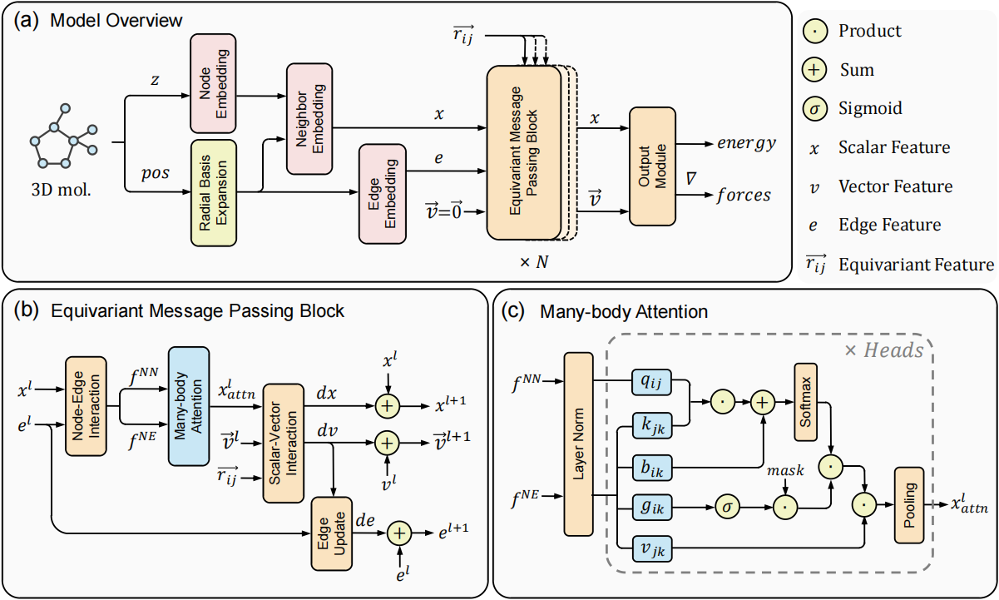

# Quadruple Attention in Many-body Systems for Accurate Molecular Property Predictions

[](https://icml.cc/Conferences/2025)

## Overview

 

We introduce MABNet, a geometric attention framework designed to model four-body interactions by facilitating direct communication among atomic quartets. This approach bypasses the computational bottlenecks associated with traditional triplet-based attention mechanisms, allowing for the efficient handling of higher-order interactions.

## Environments

Required dependencies and versions:

- Python 3.9
- PyTorch 1.11.0
- PyTorch Geometric 2.1.0
- PyTorch Lightning 1.8.0
- ASE
- OGB

## Datasets

Datasets will be automatically downloaded on first run if not present in the specified dataset root directory.

## Training

Training commands for different datasets:

* MD22
``` bash 
python train.py --conf examples/MABNet-MD22.yml --dataset-arg Ac_Ala3_NHMe --dataset-root ../dataset/md22 --log-dir ./log/MABNet_train
```

* SPICE
``` bash
python train.py --conf examples/MABNet-SPICE.yml --dataset-root ../dataset/spice --log-dir ./log/MABNet_train
```

The `conf` parameter specifies the dataset-specific configuration file provided in the examples directory. The `dataset-root` parameter indicates the location where datasets are stored. If the dataset doesn't exist on first run, it will be automatically downloaded. The `log-dir` parameter specifies where results will be saved.

For small molecule datasets, MD17 and rMD17 are also supported. You need to modify the `conf` parameter to MD17 or rMD17, and change the `dataset-arg` parameter to the specific molecular subset. The QM9 dataset is also supported - simply change the `conf` parameter to QM9 and modify the `dataset-arg` parameter to the quantum chemical property you want to predict.

## Inference

Inference commands using trained models:

``` bash 
python train.py --conf examples/MABNet-MD22.yml --dataset-arg Ac_Ala3_NHMe --dataset-root ../dataset/md22 --log-dir ./log/MABNet_test --task inference --load-model /path/to/ckpt
```

``` bash 
python train.py --conf examples/MABNet-SPICE.yml --dataset-root ../dataset/spice --log-dir ./log/MABNet_test --task inference --load-model /path/to/ckpt
```

The `load-model` parameter specifies the path to the trained model checkpoint file.